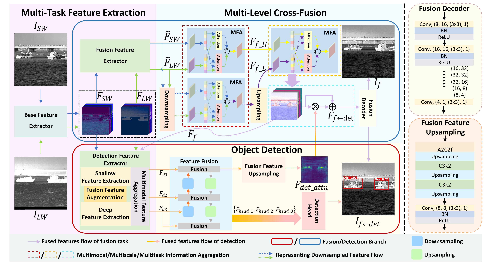

# LSFDNet: A Single-Stage Fusion and Detection Network for Ships Using SWIR and LWIR (MM '25)
> Yanyin Guo, Runxuan An, Junwei Li, Zhiyuan Zhang

> Official Pytorch implementation of LSFDNet: A Single-Stage Fusion and Detection Network for Ships Using SWIR and LWIR

> [Latest Version of the Paper](https://arxiv.org/abs/2507.20574)

### Updates:
- 🎉 LSFDNet has been accepted at MM '25: Proceedings of the 33rd ACM International Conference on Multimedia 2025.
- :exclamation: For more details, please refer to our paper [arxiv](https://arxiv.org/abs/2507.20574) or [ACM Digital Library](https://doi.org/10.1145/3746027.3755804). 

## 1. Motivation & Contribution

<div style="margin-bottom: 30px;">
  &emsp;&emsp;&emsp;&emsp;<span>(a) fog penetration</span>
  &emsp;&emsp;&emsp;&emsp;&emsp;&emsp;&emsp;&emsp;&emsp;&emsp;&emsp;&emsp;&emsp;&emsp;&emsp;&emsp;<span>(b) sea surface contrast</span>
</div>

> SWIR (Top) vs. Visible (Bottom) Imaging.

* **The Unique Advantages of SWIR:** Compared to traditional visible light, Short-Wave Infrared (SWIR) imaging offers unparalleled benefits for maritime detection. As illustrated above, SWIR can easily penetrate thin fog and smoke to maintain high clarity (Fig. a). Moreover, since seawater heavily absorbs SWIR radiation, it creates a naturally dark background that makes ship targets stand out with exceptional contrast (Fig. b).
* **Complementary Strengths of SWIR and LWIR:** LWIR is robust to lighting variations but lacks texture details. Fusing them fully exploits their complementary features for complex maritime scenarios.
* **Unified Framework —— LSFDNet:** Unlike traditional decoupled two-stage methods, we propose a novel single-stage network that seamlessly integrates image fusion and object detection into an end-to-end framework. 

## 2. Method


> Overview of the proposed LSFDNet. The LSFDNet comprises a deeply coupled fusion network and a detection network.

## 3. Usage
### 3.1 Requirements
Before using this repository, make sure you have the following prerequisites installed:

- [Anaconda](https://www.anaconda.com/download/)
- [PyTorch](https://pytorch.org)

You can install PyTorch with the following [command](https://pytorch.org/get-started/locally/) (in Linux OS):
```bash
conda install pytorch==1.11.0 torchvision==0.12.0 torchaudio==0.11.0 cudatoolkit=11.3 -c pytorch
```

### 3.2 Installation

To get started, clone this repository:
```bash
git clone https://github.com/Yanyin-Guo/LSFDNet.git
cd LSFDNet
```

Next, create the [conda](https://docs.conda.io/projects/conda/en/stable/) environment named `LSFDNet` by executing the following command:
```bash
conda env create -f environment.yml
```

Then activate the environment:
```bash
conda activate LSFDNet
```

## 4. Data Preparation

### 4.1 Introduction to the NSLSR Dataset
To address the limitations of existing datasets (e.g., limited scene diversity, monotonous backgrounds, and very few unique ship instances), we construct the **Nearshore Ship Long-Short Wave Registration Dataset (NSLSR)**. 

Captured using a custom binocular synchronous system across different time periods, NSLSR provides **1,205 precisely registered SWIR-LWIR maritime ship image pairs** (original resolution: 640×512) from diverse nearshore environments. To the best of our knowledge, this is the **first practical LWIR-SWIR dataset** specifically designed for maritime ship image fusion and detection.

Please download the NSLSR dataset here:
* [NSLSR Dataset](https://pan.baidu.com/s/1Rm5w580LnY2JRYZvEJI0fw) (code: shmp)

### 4.2 Dataset Structure and Usage
You need to organize the downloaded NSLSR dataset into the `./data` folder. Each subset serves a specific purpose for reproducing the results in our paper:

* **`NSLSR_train`**: Used for training the LSFDNet (the joint fusion and detection network).
* **`NSLSR320_val` & `NSLSR_val`**: Used for validation during training and evaluating the final **detection** performance. 
  > **Note:** The images in `NSLSR320_val` are center-cropped to **320×320** from the original 640×512 resolution to exactly reproduce the detection results reported in our paper.
* **`NSLSR_test`**: Exclusively used for evaluating the **image fusion** performance.

Ensure the folder structure is organized exactly as follows:

```text
data/
├── NSLSR_train/
│   ├── labels/
│   ├── LWIR/
│   └── SWIR/
├── NSLSR_val/
│   ├── labels/
│   ├── LWIR/
│   └── SWIR/
├── NSLSR320_val/
│   ├── labels/
│   ├── LWIR/
│   └── SWIR/
└── NSLSR_test/
    ├── labels/
    ├── LWIR/
    └── SWIR/
```

## 5. Getting Started

Before training or evaluating the models, please download the [pretrained models](https://pan.baidu.com/s/1e2NWX23QS_XdxgeszpB42Q) (code: x7sf) of LSFDNet and place them into the `./PTH/` folder.

### 5.1 Training

**1. Train the MMYOLO Network (Main Fusion & Detection)**
To train the primary network for joint fusion and ship detection, run the following distributed training command:
```bash
CUDA_VISIBLE_DEVICES=0 OMP_NUM_THREADS=1 python -m torch.distributed.run \
    --nproc_per_node=1 \
    --master_port=21132 \
    ./LSFDNet/train.py \
    --launcher pytorch \
    -opt ./LSFDNet/options/LS_MMYOLO.yaml
```

**2. Train the MMFusion Network Separately**
If you tend to train the image fusion network independently, run the following command:
```bash
CUDA_VISIBLE_DEVICES=0 OMP_NUM_THREADS=1 python -m torch.distributed.run \
    --nproc_per_node=1 \
    --master_port=21132 \
    ./LSFDNet/train.py \
    --launcher pytorch \
    -opt ./LSFDNet/options/LS_MMFusion.yaml
```

---

### 5.2 Testing

**1. Test the MMYOLO Network**
To evaluate the standard MMYOLO detection performance:
```bash
CUDA_VISIBLE_DEVICES=0 OMP_NUM_THREADS=1 python -m torch.distributed.run \
    --nproc_per_node=1 \
    --master_port=21132 \
    ./LSFDNet/test.py \
    --launcher pytorch \
    -opt ./LSFDNet/options/LS_MMYOLO_test.yaml
```

**2. Test the MMFusion Network**
To evaluate the image fusion performance separately:
```bash
CUDA_VISIBLE_DEVICES=0 OMP_NUM_THREADS=1 python -m torch.distributed.run \
    --nproc_per_node=1 \
    --master_port=21132 \
    ./LSFDNet/test.py \
    --launcher pytorch \
    -opt ./LSFDNet/options/LS_MMFusion_test.yaml
```

**3. Test the MMYOLO Network on 320×320 Resolution**
To strictly reproduce the detection results on the center-cropped 320×320 dataset as reported in our paper, run:
```bash
CUDA_VISIBLE_DEVICES=0 OMP_NUM_THREADS=1 python -m torch.distributed.run \
    --nproc_per_node=1 \
    --master_port=21132 \
    ./LSFDNet/test.py \
    --launcher pytorch \
    -opt ./LSFDNet/options/LS_MMYOLO320_test.yaml
```

## 6. Experimental Results

We evaluate our LSFDNet on both object detection and image fusion tasks. The quantitative performance on the NSLSR dataset is summarized below.

| Model Version | Resolution | mAP@0.5 | mAP@0.5:0.95 | EN | SF | SD | SCD | VI | Qabf |
|:---|:---:|:---:|:---:|:---:|:---:|:---:|:---:|:---:|:---:|
| ~~Previous LSFDNet~~ | ~~320 × 320~~ | ~~0.9620~~ | ~~0.7700~~ | ~~7.181~~ | ~~21.022~~ | ~~64.723~~ | ~~1.427~~ | ~~0.611~~ | ~~0.520~~ |
| **Updated LSFDNet** | **320 × 320** | 0.9855 | 0.7883 | 7.001 | 20.237 | 63.583 | 1.438 | 0.653 | 0.534 |
| **Updated LSFDNet** | **640 × 512** | 0.9826 | 0.7698 | 7.226 | 18.146 | 61.588 | 1.401 | 0.655 | 0.511 |
> *Note: We report both detection metrics (mAP) and image fusion evaluation metrics, including Entropy (EN), Spatial Frequency (SF), Standard Deviation (SD), Sum of the Correlations of Differences (SCD), Visual Information Fidelity (VI), and Edge Retention (Qabf).*

## Acknowledgements
Our work is built upon [ultralytics](https://www.ultralytics.com/), [MulFS-CAP](https://github.com/YR0211/MulFS-CAP) and [BasicSR](https://github.com/xinntao/BasicSR-examples/tree/master). Thanks to their authors for their excellent work!

## Citation

If you find our code, dataset, or paper useful for your research, please consider citing:

```bibtex
@inproceedings{guo2025lsfdnet,
  author    = {Guo, Yanyin and An, Runxuan and Li, Junwei and Zhang, Zhiyuan},
  title     = {LSFDNet: A Single-Stage Fusion and Detection Network for Ships Using SWIR and LWIR},
  booktitle = {Proceedings of the 33rd ACM International Conference on Multimedia},
  year      = {2025},
  pages     = {8939--8948},
  doi       = {10.1145/3746027.3755804}
}
```